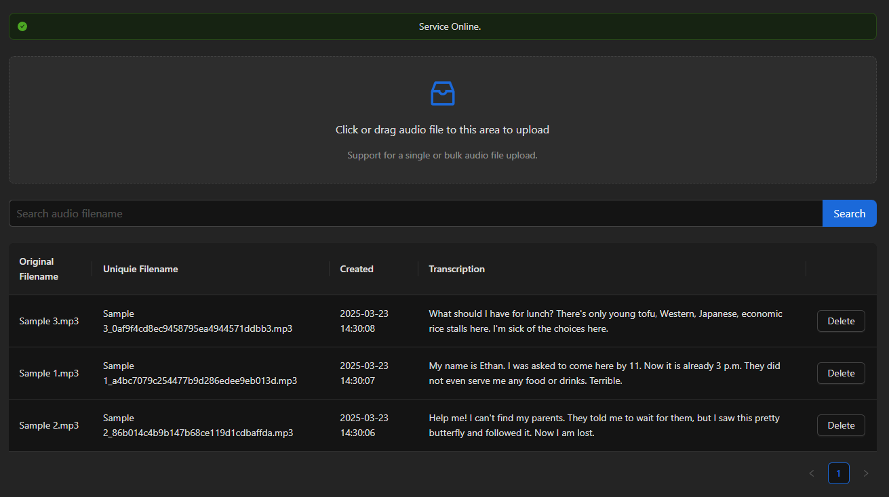

# Audio Transcriber
This is a web application for transcribing audio files using the Whisper model from OpenAI.

## Features

- Upload audio files for transcription
- List all transcriptions
- Search transcriptions by filename
- Delete transcriptions

## Prerequisites

- Docker
- Docker Compose

# Running the Setup Script

This document provides instructions for running the `setup.sh` script across different operating systems.

## Windows

Windows does not natively support shell scripts. Here are several methods to run .sh files on Windows:

### Option 1: Windows Subsystem for Linux (WSL) - Recommended

1. Enable WSL by opening PowerShell as Administrator and running:
   ```
   wsl --install
   ```

2. Restart your computer when prompted.

3. After installation, open WSL from the Start menu.

4. Navigate to the project root directory where setup.sh is located:
   ```
   cd /mnt/c/path/to/project
   ```

5. Make the setup script executable:
   ```
   chmod +x setup.sh
   ```

6. Run the setup script:
   ```
   ./setup.sh
   ```

### Option 2: Git Bash

1. Download and install Git for Windows from [git-scm.com](https://git-scm.com/download/win).

2. Open Git Bash from the Start menu.

3. Navigate to your script location.

4. Run the setup script:
   ```
   bash setup.sh
   ```

### Option 3: Cygwin

1. Download and install Cygwin from [cygwin.com](https://www.cygwin.com/).

2. Open the Cygwin terminal.

3. Navigate to your script location.

4. Make the setup script executable:
   ```
   chmod +x setup.sh
   ```

5. Run the setup script:
   ```
   ./setup.sh
   ```

## macOS

Shell scripts are natively supported in macOS:

1. Open Terminal.

2. Navigate to the project root directory:
   ```
   cd /path/to/project
   ```

3. Make the setup script executable:
   ```
   chmod +x setup.sh
   ```

4. Run the setup script:
   ```
   ./setup.sh
   ```

## Linux

Shell scripts are natively supported in Linux:

1. Open Terminal.

2. Navigate to the project root directory:
   ```
   cd /path/to/project
   ```

3. Make the setup script executable:
   ```
   chmod +x setup.sh
   ```

4. Run the setup script:
   ```
   ./setup.sh
   ```

This will:
- Create necessary directories
- Build the Docker image for both backend and frontend
- Start the FastAPI application and React Web application
- Go to http://localhost:5173 to view the web application

## Web Application Example



# Backend Unit Tests

This document explains how to set up a virtual environment and run the unit tests for this project.

## Setting Up a Virtual Environment

1. Navigate to your project directory:
   ```
   cd /backend
   ```

2. Create a virtual environment:
   ```
   python -m venv venv
   ```

3. Activate the virtual environment:
   - **Windows**:
     ```
     venv\Scripts\activate
     ```
   - **macOS/Linux**:
     ```
     source venv/bin/activate
     ```

## Installing Dependencies

Once your virtual environment is activated, install the required packages:

```
pip install pytest
pip install -r requirements.txt
```

## Running the Tests

To run all unit tests:

```
pytest tests/test_main.py
```

## Deactivating the Virtual Environment

When you're finished, you can deactivate the virtual environment:

```
deactivate
```

## API Endpoints

- `GET /health` - Check API health
- `POST /transcribe` - Upload an audio file for transcription
- `GET /transcriptions` - Get all transcriptions
- `GET /search?query=<search_term>` - Search transcriptions by filename
- `DELETE /transcriptions/{transcription_id}` - Delete a transcription

## Manual Docker Commands

If you prefer to run the commands manually:

1. Build the Docker image:
   ```bash
   docker-compose build
   ```

2. Start the service:
   ```bash
   docker-compose up -d
   ```

3. Stop the service:
   ```bash
   docker-compose down
   ```

## Project Structure

- `backend` - FastAPI application code
- `frontend` - ReactJS application code
- `docker-compose.yml` - Docker Compose configuration
- `setup.sh` - Setup script

## API Documentation

Once the service is running, you can view the Swagger UI documentation at:
http://localhost:8000/docs

## Technical Details

- The application uses the `whisper-tiny` model for transcription
- Audio files are stored in the `uploads` directory
- Transcription data is stored in a SQLite database
